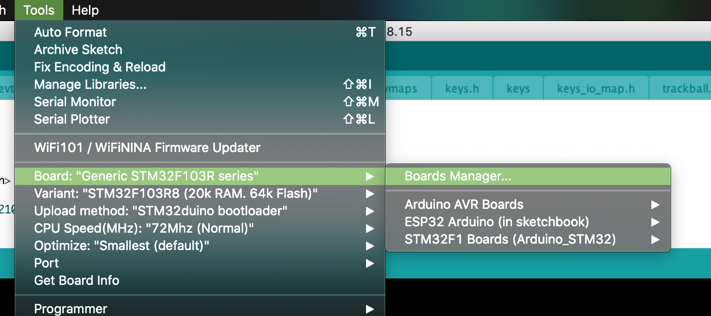

DevTerm Keyboard firmware
=========================

## Changes from official firmware:
- Fn + Trackball no longer trigger the "slow movement mote" but allow to use the mouse scroll wheel 
  (only up/down for now, need to find how to set for left/right)
- Now to set the trackball speed you use Fn + Left button for normal speed 
- Fn + Middle button for "slow" speed
- Fn + Right button is currently an unused third mode that do the same as the normal one.
- Cmd now send LEFT META by default (left command or left windows key)
- Fn + Cmd send the RIGHT META Key.
- Fn + "-" (the key just on the right of the trackball) do send a volume mute key.

### Undocumented from the official firmware (and not displayed on the keyboard):
- Fn + < to send the brightness decrease key
- Fn + > to send the brightness increase key

For the brightness setting, as far as I can say, on the CM3 model at least, there is nothing to honour these key, 
a deamon must probably need to be added for it to work.
  
## How to build the firmware

### Preparations

First download the Arduino IDE, version 1.8.13+

From there, open the Arduino IDE and open the preferences window:

And add this URL `http://dan.drown.org/stm32duino/package_STM32duino_index.json` to the "Additional Board Manager URLs".

once you click on OK, in the tool menu open the Board Manager

And in the board manager search for STM32 and install the `STM32F1xx/GD32F1xx board` package:

Install at least the version 2021.2.22

From there, in the Tool menu, select these options for the board configurations:

- Board: GENERIC STM32F103R series
- Variant: STM32F103R8
- Upload Method: STM32duino bootloader
- CPU Speed: 72Mhz

Note: It may work but I would recommend to not connect the keyboard to your PC when it is connected to the DevTerm, 
you can remove the keyboard while the DevTerm is running thanks to it using the USB protocol, so remove the keyboard
from the DT before trying to program it.

When connected to your computer, in the Tool menu, select the Port that correspond to the Keyboard.

From there in the Arduino IDE, open one of the .ino file from this folder, and because the arduino IDE is a bit
annoying at time, you should close any other open window.

### Compile and build

From there, you can click on the upload button to compile and send the new firmware to the keyboard.

## Some warnings about the code

If you want to get any log from the keyboard, only use the function `dev_term._Serial->println("");` 
instead of `Serial.println()` else you will hangup the firmware and make it impossible to reflash without using
an external programmer, so be careful.